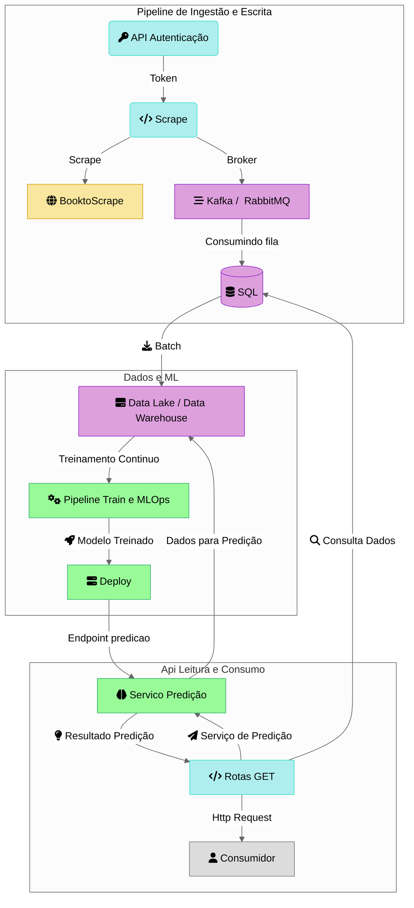
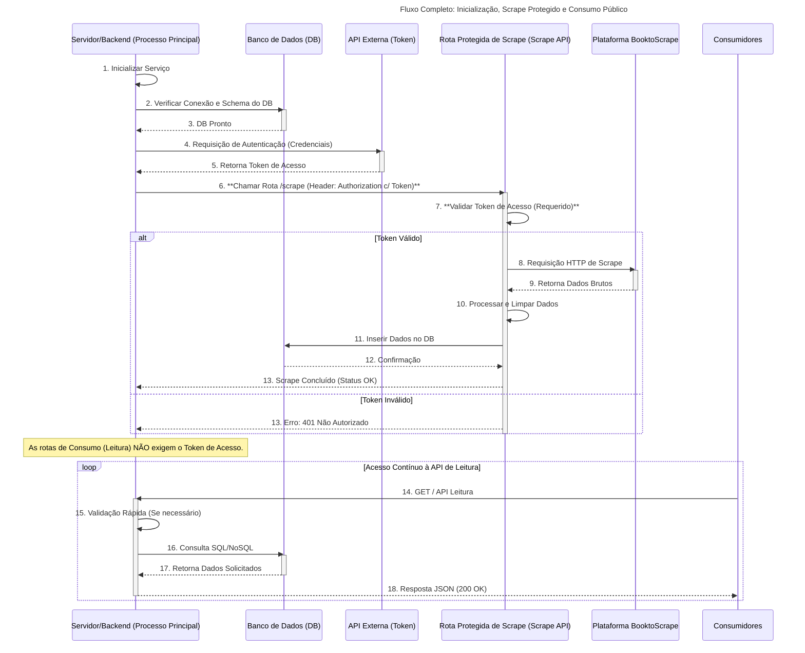

# TechChallenge Fase I
> A API permite coletar (***via Web Scrape***) e consultar informações detalhadas sobre livros de diferentes tilulos a partir da plataforma  BooktoScrape, alem de fornecer estatisticas detalhadas com base nos dados coletados

**URL: BASE**
- #### PRODUÇÂO 
    ```bash
           API PRODUÇÃO:  https://booktoscrape-1.onrender.com
           URL SWAGGER:  https://booktoscrape-1.onrender.com/docs

    ````
- ### Apresentação do Projeto
```bash
    Link Video: YouTube
```

**Pipeline**
- Pipeline pensado para escalabilidade Futura

**Diagrama de Sequencia**


# 📚 BooktoScrape API

<!-- **URL Base** '/api/v1/login' -->
> API desenvolvida com **FastAPI** e **SQLAlchemy** para realizar web scraping do site [Books to Scrape](https://books.toscrape.com/) e armazenar os dados em um banco **SQLite**.

## 🚀 Tecnologia
|Tecnologia|Descrição|
|-------------|------------|
| **FastAPI** | Framework para criação de endpoints rápidos e tipados |
| **SQLAlchemy** | ORM para manipulação de dados |
| **SQLite** | Banco de dados leve e local |

---
### Execução do Projeto

1. **Clone o repositório** 
    ```bash
    git@github.com:souzapaulosergio/BooktoScrape.git
    cd BooktoScrape
2. **Crie a ambiente virtual
    ````bash
    python -m  venv venv
3. **Ative o ambiente virtual**    
    ```bash 
    🪟 Windows
    venv\Scripts\activate

    🐧 Linux
    source venv/bin/activate
4. **Instale as depêndencias**
    ```bash
    pip install -r requirements.txt
5. **Execute o Servidor
    ```bash
    uvicorn main:app --reload

    obs. A base de dados será criada automaticamente na primeira execução

## 🌐 EndPoints

🔑 Autenticação

### POST /api/v1/login
```json
    {
    "username": "admin",
    "password": "admin123"
    }
   
```

### Response
```json
    {
      "access_token": "eyJhbGciOiJIUzI1..."
    }
```
***Use o token no botão Authorize da interface Swagger (/docs).***

## 📘 Web Scraping
### GET /api/v1/bookscraping
Realiza o scraping do site Book to Scrape e armazena os dados na base

Auth: Bearer <token>

## 📚 Livros

| Método | Endpoint                                  | Descrição                      |
| ------ | ----------------------------------------- | ------------------------------ |
| `GET`  | `/api/v1/books`                           | Lista todos os livros          |
| `GET`  | `/api/v1/books/{book_id}`                 | Busca um livro por ID          |
| `GET`  | `/api/v1/books/top-rated`                 | Lista livros com melhor rating |
| `GET`  | `/api/v1/books/search?titulo=<nome>`      | Busca por título               |
| `GET`  | `/api/v1/books/price-range?min=20&max=30` | Filtra por faixa de preço      |

## API de Consulta Livros
### Descrição
- ### Exemplo de chamada Lista todos os Livros
    ```bash
    curl -X GET "http://127.0.0.1:8000/api/v1/books"

    Respose 200:
    [
        {
            "categoria": "string",
            "titulo": "string",
            "moeda": "string",
            "preco": 0,
            "rating": 0,
            "estoque": "string",
            "created_at": "2025-10-31T19:51:56.005Z",
            "id": 0
        }
    ]

    ```
### Exemplo de chamada Lista Top Rated 
 ```bash
    curl -X GET "http://127.0.0.1:8000/api/v1/books/top_rated"

    Respose:
    [
        {
            "categoria": "string",
            "titulo": "string",
            "moeda": "string",
            "preco": 0,
            "rating": 0,
            "estoque": "string",
            "created_at": "2025-10-31T19:55:00.765Z",
            "id": 0
        }
    ]

```

## Pequisa por Titulo e/ou Categoria
### Descrição
- Retorna os dados coletados pela a API, permitindo filtros opcionais

- ### Parâmetros
    | Nome              | Tipo      | Obrigatório   | Descrição
    | ----------------- | --------- | --------------|-----------------------|
    |Titulo             | string    | true          |Pesquisa por Titulos   |
    |Categoria          | string    | true          |Pesquisa por Categoria |

-   ### Exemplo de chamada

    ```bash
        curl -X GET "http://127.0.0.1:8000/api/v1/books/search?categoria=Mystery" -H "accept: application/json"

        Respose 200:
        [
            {
                "categoria": "string",
                "titulo": "string",
                "moeda": "string",
                "preco": 0,
                "rating": 0,
                "estoque": "string",
                "created_at": "2025-10-31T19:56:57.523Z",
                "id": 0
            }
            ]
        422 Validation Error
        {
            "detail": [
                {
                "loc": [
                    "string",
                    0
                ],
                "msg": "string",
                "type": "string"
                }
            ]
            }

    ```

## API Pesquisa por Preço mínimo e maximo
### Descrição
- Retorna os dados coletados pela a API, permitindo filtros obrigatório por preço minimo e máximo

- Parâmetros
    |Nome       | Tipo  | Obrigatorio |Descrição                        | 
    |-----------|------ | ------------|---------------------------------|
    | min       | float |   true      | Permite filtar por valor Minimo |
    | max       | float |   true      | Premite filtar por valor maximo |

- ### Exemplo de chamada
    ```bash
    curl -X GET "http://127.0.0.1:8000/api/v1/books/price-range?min=20&max=30" -H "accept: application/json"

        Respose:
            [
                {
                    "categoria": "string",
                    "titulo": "string",
                    "moeda": "string",
                    "preco": 0,
                    "rating": 0,
                    "estoque": "string",
                    "created_at": "2025-10-31T20:03:57.349Z",
                    "id": 0
                }
        ]
        Validation error
        {
            "detail": [
                {
                "loc": [
                    "string",
                    0
                ],
                "msg": "string",
                "type": "string"
                }
            ]
            }
    ```
## API pesquisa livros por id
- ### Detalhes
    Retorna os dados coletados pela a API, permitindo filtros obrigatório por id
    
- ### Parâmetros
    | Nome  | Tipo      | Obrigatório   | Descrição
    | ------| --------- | --------------|------------------------|
    |id     | int       | true          |permite pesquisar por id|

- ## Exemplo de chamada
    ```bash
    curl -X GET "http://127.0.0.1:8000/api/v1/books/1" -H "accept: application/json"

        Respose:
        {
            "categoria": "string",
            "titulo": "string",
            "moeda": "string",
            "preco": 0,
            "rating": 0,
            "estoque": "string",
            "created_at": "2025-10-31T20:09:41.683Z",
            "id": 0
        }
        Validation error
        {
            "detail": [
                {
                "loc": [
                    "string",
                    0
                ],
                "msg": "string",
                "type": "string"
                }
            ]
            }
    ```
## API Categorias
- ### Detalhe
    -   Retorna todas as Categorias coletados pela a API

### Tabela
| Método | Endpoint                                  | Descrição                      |
|--------|-------------------------------------------|--------------------------------|
| `GET`  | `/api/v1/categories`                      | Lista todas as categorias      |

-   ### Exemplo de chamda
    ```bash
    curl -X GET "http://127.0.0.1:8000/api/v1/categories" -H "accept: application/json"

        Respose:
        [
            {
                "category": "string"
            }
        ] 
    ```

## 📊 Estatísticas
- ### Tabela
    | Endpoint                       | Descrição                                                         |
    | ------------------------------ | ----------------------------------------------------------------- |
    | `GET /api/v1/stats/overview`   | Estatísticas gerais (total, preço médio, distribuição de ratings) |
    | `GET /api/v1/stats/categories` | Estatísticas por categoria                                        |

## &#x1FA7A; Health Check

### GET /api/health
- Response:
    ```json
    {
    "status": "healthy"
    }
    ```
# Estrutura de pastas

```bash
booktowebscrape-api
├── 📁 app
│   ├── api/
│   |   ├── middleware/
|   |   |   ├── __init__.py
|   |   |   └── logging_middleware.py
|   |   ├── routes/
|   |   |   ├── __init__.py
|   |   |   ├── auth_route.py
|   |   |   └── book_routes.py
|   |   └── __init__.py
│   ├──📁 application
|   |   ├── services/
|   |   |   ├── imagens/
|   |   |   ├── __init__.py
|   |   |   ├── book_service.py
|   |   |   └── jwt_service.py
|   |   └── __init__.py
│   ├──📁 core
|   |   ├── __init__.py
|   |   ├── book.db  
|   |   ├── config.py
|   |   ├── database.py
|   |   └── logging_config.py
│   ├──📁 domain
|   |   ├── entities/
|   |   |   ├── __init__.py
|   |   |   └── books.py
|   |   ├── schemas/
|   |   |   ├── __init__.py
|   |   |   ├── auth.py
|   |   |   └── book.py
|   |   └── __init__.py
│   ├──📁 infrastructure
|   |   ├── __init__.py
|   |   └── book_repository.py
|   └── __init__.py
├── 📁 venv
├──⚙️ .env
├──🛑 .gitignore
├── main.py
├── README.md
├── requeirements.txt
├── run.py
```

### Ferramentas de Desenvolvimento

- FastAPI
- SQLAlchemy ORM
- Uvicorn
- SQLite