# techchallenge Fase I
API de gerenciamento de Livros fornece *endpoints* Restful para gerenciamento de livros, busca de livros por id, categoria, preço, maior avalição. 

**Pipeline**

```mermaid
---
config:
  theme: neutral
  layout: dagre
---
flowchart TB
 subgraph subGraph0["Pipeline de Ingestão e Escrita"]
        A("fa:fa-key API Autenticação")
        B("fa:fa-code Scrape")
        C["fa:fa-globe BooktoScrape"]
        L["fa:fa-stream Kafka / fa:fa-rabbit RabbitMQ"]
        D[("fa:fa-database SQL")]
  end
 subgraph subGraph1["Api Leitura e Consumo"]
        J["fa:fa-brain Servico Predição"]
        E["fa:fa-code Rotas GET"]
        F["fa:fa-user Consumidor"]
  end
 subgraph subGraph2["Dados e ML"]
        G["fa:fa-hdd Data Lake / Data Warehouse"]
        H["fa:fa-cogs Pipeline Treinamento e MLOps"]
        I["fa:fa-server Deploy"]
  end
    A -- Token --> B
    B -- Scrape --> C
    B -- Broker --> L
    L -- Consumindo fila --> D
    E -- "fa:fa-search Consulta Dados" --> D
    E -- Http Request --> F
    D -- "fa:fa-download Batch" --> G
    G -- Treinamento Continuo --> H
    H -- "fa:fa-rocket Modelo Treinado" --> I
    E -- "fa:fa-paper-plane Serviço de Predição" --> J
    J -- "fa:fa-lightbulb Resultado Predição" --> E
    I -- Endpoint predicao --> J
    J -- Dados para Predição --> G
     A:::write_service
     B:::write_service
     C:::external
     L:::data_storage
     D:::data_storage
     J:::ml_service
     E:::write_service
     F:::consumer
     G:::data_storage
     H:::ml_service
     I:::ml_service
    classDef external fill:#F9E79F,stroke:#DAA520
    classDef write_service fill:#AFEEEE,stroke:#40E0D0
    classDef data_storage fill:#DDA0DD,stroke:#9932CC
    classDef processing fill:#F08080,stroke:#B22222
    classDef ml_service fill:#98FB98,stroke:#3CB371
    classDef consumer fill:#DCDCDC,stroke:#808080
    style subGraph0 color:#000000
```

**Diagrama de Sequencia**

```mermaid
sequenceDiagram
    title: Fluxo Completo: Inicialização, Scrape Protegido e Consumo Público
    %% Definição dos Participantes
    participant S as Servidor/Backend (Processo Principal)
    participant D as Banco de Dados (DB)
    participant A as API Externa (Token)
    participant R as Rota Protegida de Scrape (Scrape API)
    participant W as Site
    participant C as Consumidores 

    %% 1. Inicialização do Servidor e DB
    S->>S: 1. Inicializar Serviço
    S->>D: 2. Verificar Conexão e Schema do DB
    activate D
    D-->>S: 3. DB Pronto
    deactivate D

    %% 2. Busca do Token
    S->>A: 4. Requisição de Autenticação (Credenciais)
    activate A
    A-->>S: 5. Retorna Token de Acesso
    deactivate A

    %% 3. Autenticação e Início do Scrape (PROTEGIDO)
    S->>R: 6. **Chamar Rota /scrape (Header: Authorization c/ Token)**
    activate R
    R->>R: 7. **Validar Token de Acesso (Requerido)**
    alt Token Válido
        R->>W: 8. Requisição HTTP de Scrape
        activate W
        W-->>R: 9. Retorna Dados Brutos
        deactivate W
        
        R->>R: 10. Processar e Limpar Dados
        R->>D: 11. Inserir Dados no DB
        D-->>R: 12. Confirmação
        R-->>S: 13. Scrape Concluído (Status OK)
    else Token Inválido
        R-->>S: 13. Erro: 401 Não Autorizado
    end
    deactivate R    

    Note over S: As rotas de Consumo (Leitura) NÃO exigem o Token de Acesso.

    %% 4. Consumo Contínuo das Rotas da API (PÚBLICO)
    loop Acesso Contínuo à API de Leitura
        C->>S: 14. GET / API Leitura
        activate S
        S->>S: 15. Validação Rápida (Se necessário)
        S->>D: 16. Consulta SQL/NoSQL
        activate D
        D-->>S: 17. Retorna Dados Solicitados
        deactivate D
        S-->>C: 18. Resposta JSON (200 OK)
        deactivate S
    end
```



# 📚 BooktoScrape API

<!-- **URL Base** '/api/v1/login' -->
> API desenvolvida com **FastAPI** e **SQLAlchemy** para realizar web scraping do site [Books to Scrape](https://books.toscrape.com/) e armazenar os dados em um banco **SQLite**.

## 🚀 Tecnologia
|Tecnologia|Descrição|
|-------------|------------|
| **FastAPI** | Framework para criação de endpoints rápidos e tipados |
| **SQLAlchemy** | ORM para manipulação de dados |
| **SQLite** | Banco de dados leve e local |

---

1. **Clone o repositório** 
    ```bash
    git@github.com:souzapaulosergio/BooktoScrape.git
    cd BooktoScrape
2. **Crie a ambiente virtual
    ````bash
    python -m  venv venv
3. **Ative o ambiente virtual**    
    ```bash 
    🪟 Windows
    venv\Scripts\activate

    🐧 Linux
    source venv/bin/activate
4. **Instale as depêndencias**
    ```bash
    pip install -r requirements.txt
5. **Execute o Servidor
    ```bash
    uvicorn main:app --reload

    obs. A base de dados será criada automaticamente na primeira execução

## 🌐 EndPoints

🔑 Autenticação

### POST /api/v1/login
```json
    {
    "username": "admin",
    "password": "admin123"
    }
   
```

### Response
```json
    {
      "access_token": "eyJhbGciOiJIUzI1..."
    }
```
***Use o token no botão Authorize da interface Swagger (/docs).***

## 📘 Web Scraping
### GET /api/v1/bookscraping
Realiza o scraping do site Book to Scrape e armazena os dados na base

Auth: Bearer <token>

## 📚 Livros

| Método | Endpoint                                  | Descrição                      |
| ------ | ----------------------------------------- | ------------------------------ |
| `GET`  | `/api/v1/books`                           | Lista todos os livros          |
| `GET`  | `/api/v1/books/{book_id}`                 | Busca um livro por ID          |
| `GET`  | `/api/v1/books/top-rated`                 | Lista livros com melhor rating |
| `GET`  | `/api/v1/books/search?titulo=<nome>`      | Busca por título               |
| `GET`  | `/api/v1/books/price-range?min=20&max=30` | Filtra por faixa de preço      |
| `GET`  | `/api/v1/categories`                      | Lista todas as categorias      |

### Exemplo de chamada Lista todos os Livros
   ```bash
    curl -X GET "http://127.0.0.1:8000/api/v1/books"

    Respose 200:
    [
        {
            "categoria": "string",
            "titulo": "string",
            "moeda": "string",
            "preco": 0,
            "rating": 0,
            "estoque": "string",
            "created_at": "2025-10-31T19:51:56.005Z",
            "id": 0
        }
    ]

```
### Exemplo de chamada Lista Top Rated 
 ```bash
    curl -X GET "http://127.0.0.1:8000/api/v1/books/top_rated"

    Respose:
    [
        {
            "categoria": "string",
            "titulo": "string",
            "moeda": "string",
            "preco": 0,
            "rating": 0,
            "estoque": "string",
            "created_at": "2025-10-31T19:55:00.765Z",
            "id": 0
        }
    ]

```

### Exemplo de chamada Pesquisa por Titulo e/ou Categoria 
```bash
    curl -X GET "http://127.0.0.1:8000/api/v1/books/search?categoria=Mystery" -H "accept: application/json"

    Respose 200:
      [
        {
            "categoria": "string",
            "titulo": "string",
            "moeda": "string",
            "preco": 0,
            "rating": 0,
            "estoque": "string",
            "created_at": "2025-10-31T19:56:57.523Z",
            "id": 0
        }
        ]
    422 Validation Error
    {
        "detail": [
            {
            "loc": [
                "string",
                0
            ],
            "msg": "string",
            "type": "string"
            }
        ]
        }

```

### Exemplo de chamda Pesquisa por Preço
```bash
   curl -X GET "http://127.0.0.1:8000/api/v1/books/price-range?min=20&max=30" -H "accept: application/json"

    Respose:
        [
            {
                "categoria": "string",
                "titulo": "string",
                "moeda": "string",
                "preco": 0,
                "rating": 0,
                "estoque": "string",
                "created_at": "2025-10-31T20:03:57.349Z",
                "id": 0
            }
    ]
    Validation error
    {
        "detail": [
            {
            "loc": [
                "string",
                0
            ],
            "msg": "string",
            "type": "string"
            }
        ]
        }
```
### Exemplo de chamda Pesquisa por id
```bash
   curl -X GET "http://127.0.0.1:8000/api/v1/books/1" -H "accept: application/json"

    Respose:
    {
        "categoria": "string",
        "titulo": "string",
        "moeda": "string",
        "preco": 0,
        "rating": 0,
        "estoque": "string",
        "created_at": "2025-10-31T20:09:41.683Z",
        "id": 0
    }
    Validation error
    {
        "detail": [
            {
            "loc": [
                "string",
                0
            ],
            "msg": "string",
            "type": "string"
            }
        ]
        }
```
### Exemplo de chamda Lista Todas as Categorias
```bash
   curl -X GET "http://127.0.0.1:8000/api/v1/categories" -H "accept: application/json"

    Respose:
    [
        {
            "category": "string"
        }
    ] 
```

## 📊 Estatísticas

| Endpoint                       | Descrição                                                         |
| ------------------------------ | ----------------------------------------------------------------- |
| `GET /api/v1/stats/overview`   | Estatísticas gerais (total, preço médio, distribuição de ratings) |
| `GET /api/v1/stats/categories` | Estatísticas por categoria                                        |

&#x1FA7A; Health Check

### GET /api/health
Response:
```json
{
  "status": "healthy"
}
```


**Estutura de pastas**


### Ferramentas de Desenvolvimento

- FastAPI
- SQLAlchemy ORM
- Uvicorn
- SQLite


<!-- 


1. Instalação: Clone o repositório:

    git@github.com:souzapaulosergio/BooktoScrape.git

2. Criação do ambiente virtual
    python -m venv venv
    ***Ativar ambiente virtual***
    - **Windows** venv/Scripts/activate 
    - **Linux/MAC**: source venv/bin/activate

    pip install -r requirements.txt

3. Executa server
    uviconr main:app -- reload
    base e tabela será criada


4. EndPoints
    Execução pelo Swagger (http://127.0.0.1:8000/docs)
    
    ***API Web Scraping: efetua o scraping dados no Site Book to scraping e armazena na base de dados SQLite

        Obter token
            ***POST /api/v1/login***
            Headers
            Content-Type: application/json
        Parâmentros:
           {
            "username": "admin",
            "password": "admin123"
            }
        response:
            {
                "access_token": "eyJhbGciOiJIUzI1iIsInR5cCI6I..."
            }

        pegue o access token e inclua na area de Authorize e salve

        ***GET /api/v1/bookscraping*** API de Web Scraping -- Tabela sera carregada com dados do Site https://books.toscrape.com/
            Authorization: Bearer <token>

    request: **GET /api/v1/books***: lista todos os livros 
    response sucesso (200):
    [
        {
            "categoria": "string",
            "titulo": "string",
            "moeda": "string",
            "preco": 0,
            "rating": 0,
            "estoque": "string",
            "created_at": "2025-10-07T23:45:09.217Z",
            "id": 0
        }
        ]

    request: ***GET /api/v1/books/top-rated**: Lista livros com maior rating  
    response sucesso (200):
        [
            {
                "categoria": "string",
                "titulo": "string",
                "moeda": "string",
                "preco": 0,
                "rating": 0,
                "estoque": "string",
                "created_at": "2025-10-07T23:46:07.550Z",
                "id": 0
            }
        ]
    
    request: ***GET /api/v1/books/search?titulo=Scott Pilgrim's Precious Little Life (Scott Pilgrim %231)***: Lista livros pelo Titulo
    response sucesso (200): 
       [
            {
                "categoria": "string",
                "titulo": "string",
                "moeda": "string",
                "preco": 0,
                "rating": 0,
                "estoque": "string",
                "created_at": "2025-10-07T23:47:56.544Z",
                "id": 0
            }
        ]

    request: *** GET /api/v1/books/price-range?min=20&max=30***: Lista usando filtro de preço min e max 
    response sucesso (200): 
        [
            {
                "categoria": "string",
                "titulo": "string",
                "moeda": "string",
                "preco": 0,
                "rating": 0,
                "estoque": "string",
                "created_at": "2025-10-07T23:49:20.729Z",
                "id": 0
            }
        ] 

    request: ***GET /api/v1/books/{book_id}***: lista livros filtrando pelo ID
    response sucesso (200):
           {
                "categoria": "string",
                "titulo": "string",
                "moeda": "string",
                "preco": 0,
                "rating": 0,
                "estoque": "string",
                "created_at": "2025-10-07T23:50:59.672Z",
                "id": 0
            }

    request: ***GET /api/v1/categorias***: lista categorias
    response sucesso (200):
       [
            {
                "category": "string"
            }
        ]


    request: ***GET /api/v1/stats/overview***: lista categorias
    response sucesso (200):
      {
        "total_livros": 0,
        "preco_medio": 0,
        "distribuicao_ratings": {
                "additionalProp1": 0,
                "additionalProp2": 0,
                "additionalProp3": 0
            }
        }

    request: ***GET /api/v1/stats/categories***: lista Estatistica de categorias
    response sucesso (200):
      {
        "total": 0,
        "category": {
            "additionalProp1": {
            "total": 0,
            "prices": [
                0
            ]
            },
            "additionalProp2": {
            "total": 0,
            "prices": [
                0
            ]
            },
            "additionalProp3": {
            "total": 0,
            "prices": [
                0
            ]
            }
        }
        }   

    Request: ***GET /api/health***: verificar se a api esta conectando com a base de dados
    response:
        {
            "status": "healthy"
        }     -->


